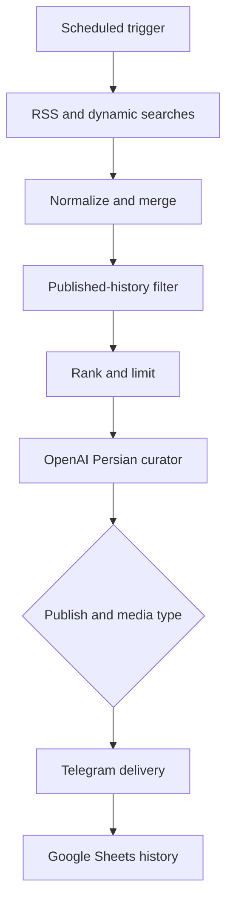

# AI Welding Media Curator for n8n

[](LICENSE)
[](https://n8n.io/)

An automated n8n workflow that discovers welding-related media, ranks it, evaluates it with an LLM, creates a Persian Telegram post, and records successful publications to prevent duplicates.

> This repository contains a safe template. It includes no API keys, access tokens, n8n credentials, execution data, or private document identifiers.

## Live output

See selected welding content published by the workflow:

- Telegram: [Welding News FA](https://t.me/Welding_News_FA)

## Live channel

The workflow supports [Welding News FA](https://t.me/Welding_News_FA), a Persian-language Telegram community with more than 10,000 members. The channel is the real-world publishing destination for curated welding news, practical media, and industry content.

## What it does

- Collects welding content from Google News RSS, the Fronius Welding Blog, YouTube, and GIPHY
- Generates rotating searches for TIG, MIG, laser, robotic, pipe, safety, inspection, and repair welding
- Normalizes videos, GIFs, images, and articles into one data model
- Scores media by relevance, format, engagement, and practical welding value
- Sends at most two candidates per run to OpenAI
- Produces a structured Persian post for welding professionals
- Publishes videos, GIFs, photos, YouTube previews, or a text fallback to Telegram
- Records successful publications in Google Sheets and skips duplicates in later runs

## Workflow overview



## Requirements

- n8n with the Code, HTTP Request, RSS Feed Read, Google Sheets, Merge, Limit, IF, Wait, Schedule Trigger, and Remove Duplicates nodes
- OpenAI API credential configured in n8n
- Google Sheets OAuth2 credential configured in n8n
- Telegram bot token and target chat/channel ID
- YouTube Data API v3 key
- GIPHY API key
- A Google Sheet with the columns described in [docs/setup.md](docs/setup.md)

## Quick start

1. Import [`workflow/welding-media-curator.template.json`](workflow/welding-media-curator.template.json) into n8n.
2. Keep the workflow inactive while configuring it.
3. Replace all `REPLACE_WITH_*` placeholders.
4. Select your own OpenAI and Google Sheets credentials in the relevant nodes.
5. Create the publication-history sheet and map its columns.
6. Run the workflow manually with a private test channel.
7. Verify every Telegram branch and confirm that successful posts are recorded only once.
8. Activate the schedule only after the tests pass.

Validate the public export locally before committing it:

```bash
node scripts/validate-workflow.mjs
```

The same check runs in GitHub Actions for every push and pull request.

Detailed instructions are in [docs/setup.md](docs/setup.md). The design and known limitations are described in [docs/architecture.md](docs/architecture.md).

## Safety and cost controls

- The workflow limits OpenAI processing to two items per scheduled run.
- The LLM can reject irrelevant, promotional, low-value, or unsafe content.
- The publication history prevents repeated posts across executions.
- The repository template is inactive by default.

The LLM still makes probabilistic decisions. Review its output and test in a private channel before unattended production use.

## Schedule

The included template runs ten times daily at 06:00, 08:00, 09:30, 11:00, 13:00, 14:30, 16:00, 18:00, 19:30, and 21:00 according to the n8n instance timezone. Adjust the Schedule Trigger for your deployment.

## Example output

See [`examples/sample-output.json`](examples/sample-output.json) for a fictional, non-published response matching the curator schema.

## Security

Never commit a production workflow export before scanning it for tokens and identifiers. If a secret is committed, rotate it immediately; deleting it in a later commit does not remove it from Git history. See [SECURITY.md](SECURITY.md).

## License

Released under the [MIT License](LICENSE).
